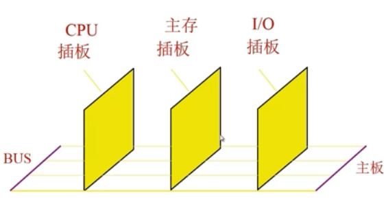
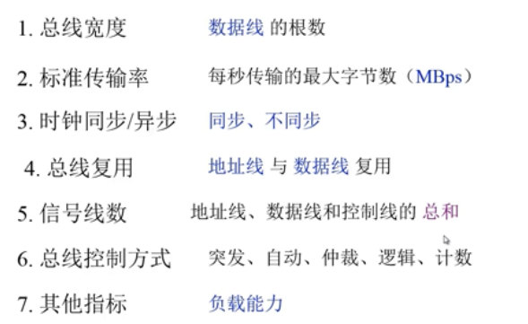
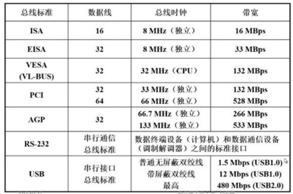

#### 总线性能及性能指标

- 总线物理实现

  

- 总线特性

  1. 机械特性		尺寸、形状、`管脚数`及排列顺序
  2. 电气特性        传输方向和有效的`电平`范围 	
  3. 功能特性         每根传输线的功能（地址、数据、控制）
  4. 时间特性        信号的`时序`关系

- 总线的性能指标

  

- 总线标准

  

> ISA：工业标准体系结构

> VESA：视频电子标准协会

> PCI：外设部件互联标准

> AGP：点对点局部总线（主芯片、显卡控制）