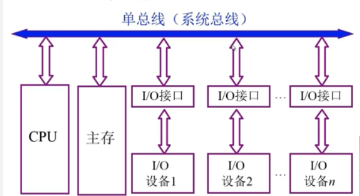
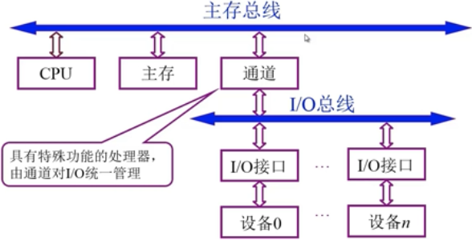
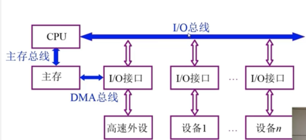
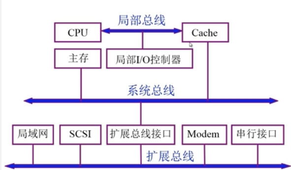
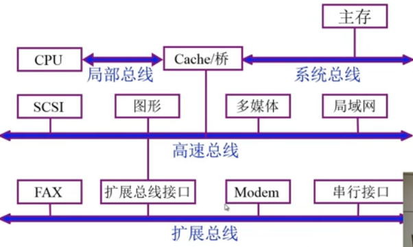
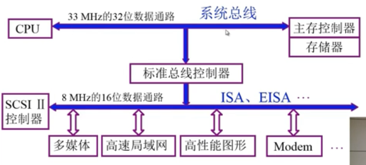
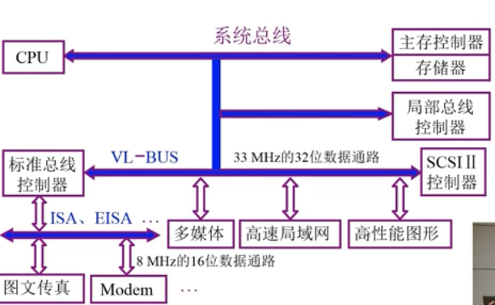
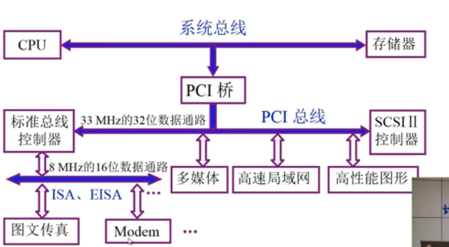

#### 总线结构

- 单总线结构

  

- 多总线结构

  1. 双总线结构

     

  2. 三总线结构

     

     DMA：直接存储器访问

     

     扩展总线连接过多外部设备影响速率

  3. 四总线结构

     

- 总线结构举例

  1. 传统微型机总线结构

     

     分离系统总线跟I/O总线

  2. VL-BUS局部总线结构

     

     通过高速总线分离I/O设备

  3. PCI总线结构

     

  4. 多层PCI总线结构

     

     通过桥电路扩展总线