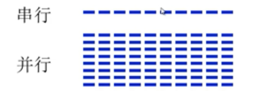
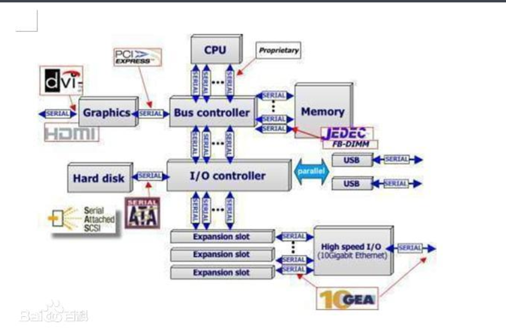
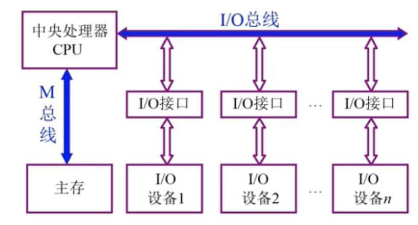
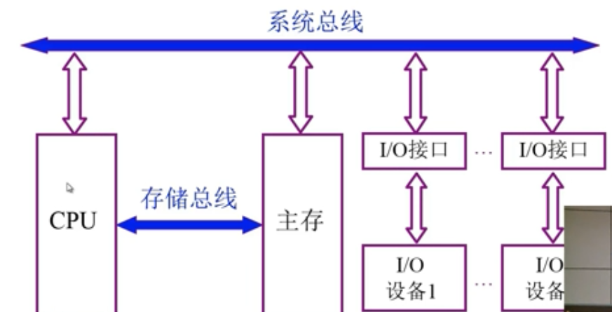

- 为什么要用总线

  根据`冯诺依曼计算机`结构，将计算机分成5个部分。各个部分之间交互连接需要。为了解决：

  1. 分散连接`的通信线路繁多`
  2. `接口`占用大量空间
  3. 外扩难度大
  
- 什么是总线

  总线是连接各个部件的信息传输线，是`各个部件共享的传输介质`

  任何时刻只能有一对设备使用系统总线

- 总线上信息的传输

  

- [x] 并行接口速度比串行接口速度快，这是若干年前的情况了。
  在实际时钟频率比较低的情况下，并口因为可以同时传输若干比特，速率确实比串口快。
  但是，随着技术的发展，时钟频率越来越高，并行导线之间的相互干扰越来越严重。并行接口因为有多条并行且紧密的导线，但时钟频率提高的一定程度时，传输的数据已经无法恢复。
  而串口因为导线少，线间干扰容易控制，反而可以通过不断提高时钟频率来提高传输速率。而且串口的端子也会比较小。这就是为什么现在高速传输都采用串行方式的原因。“众人拾柴火焰高”是句老话，但电脑领域却发生了多根线比不过1根线的怪事。无论从通信速度、造价还是通信质量上来看，现今的串行传输方式都比并行传输方式更胜一筹。

  

- 总线结构计算机举例

  

以CPU为中心的双总线结构

缺陷：主存跟外部设备没有信息传输通路，若发生信息传输CPU运算依然会被打断。

以存储器为中心的双总线结构

缺陷：目前两条总线仍是分时而作
